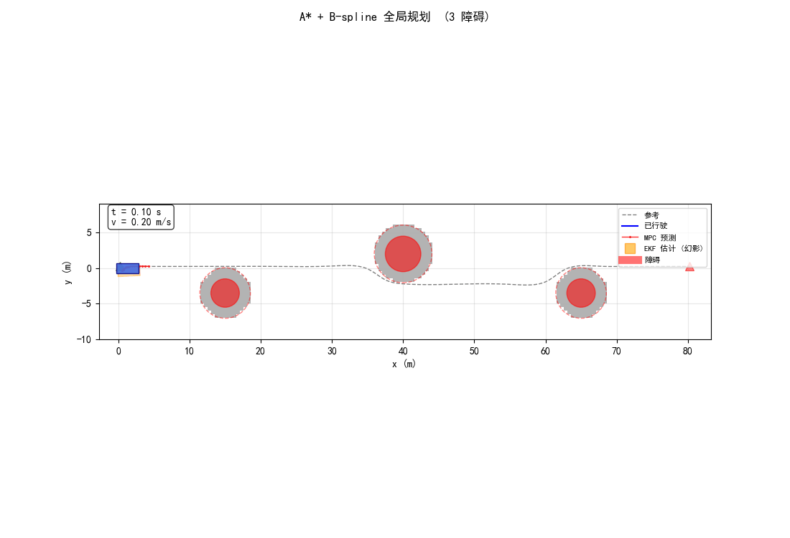
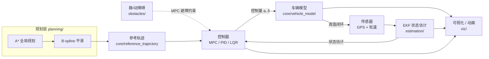
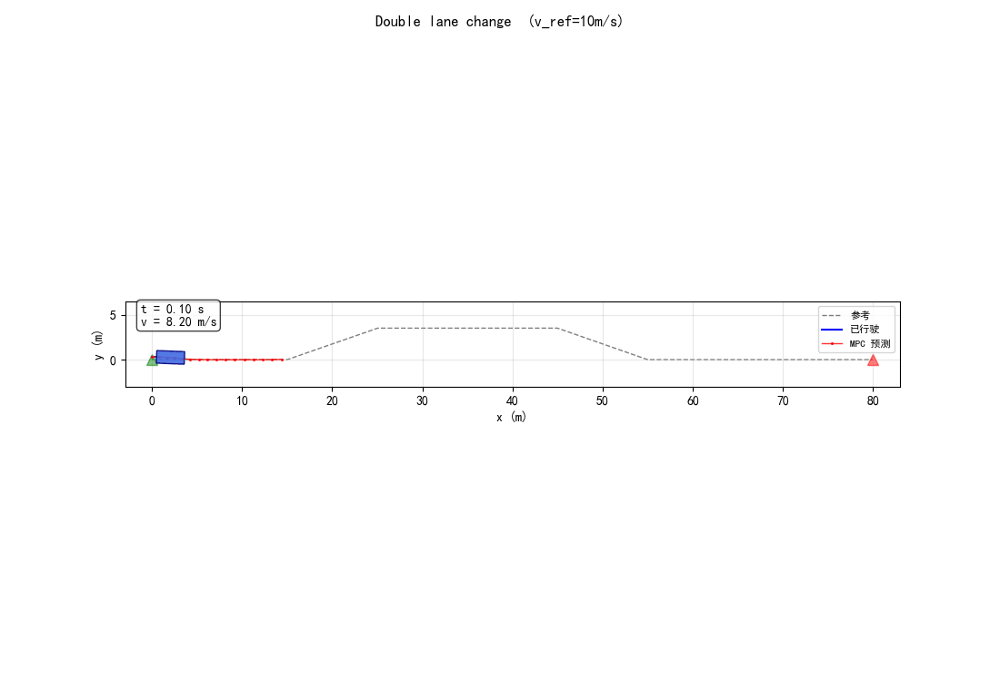
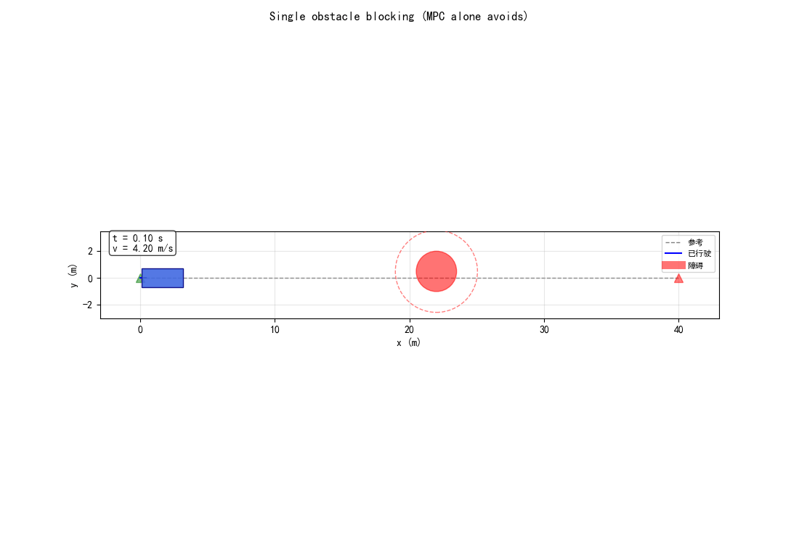
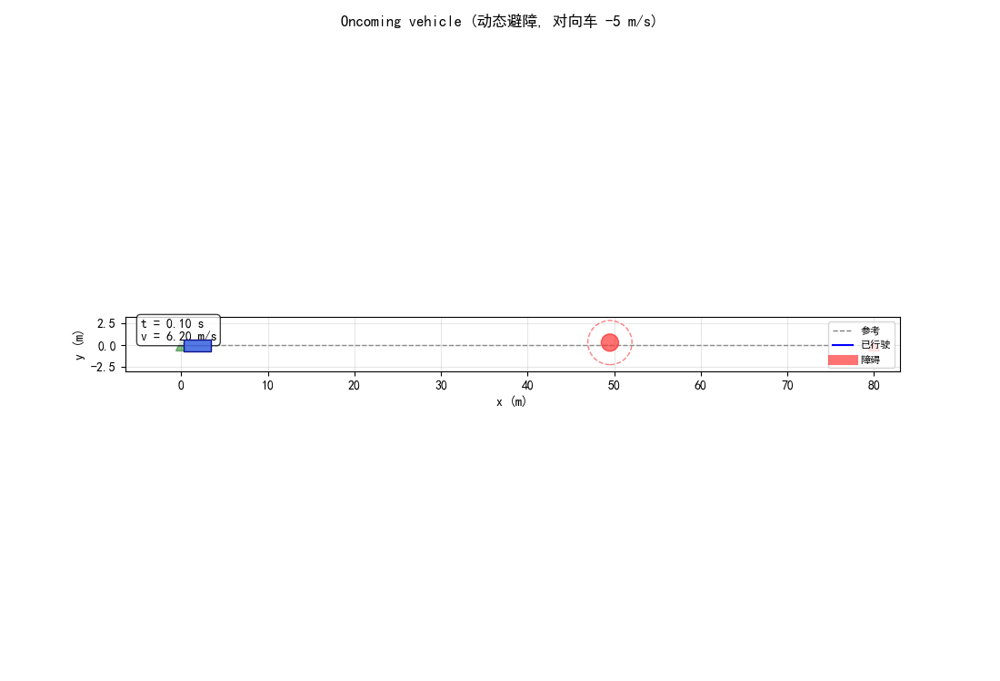
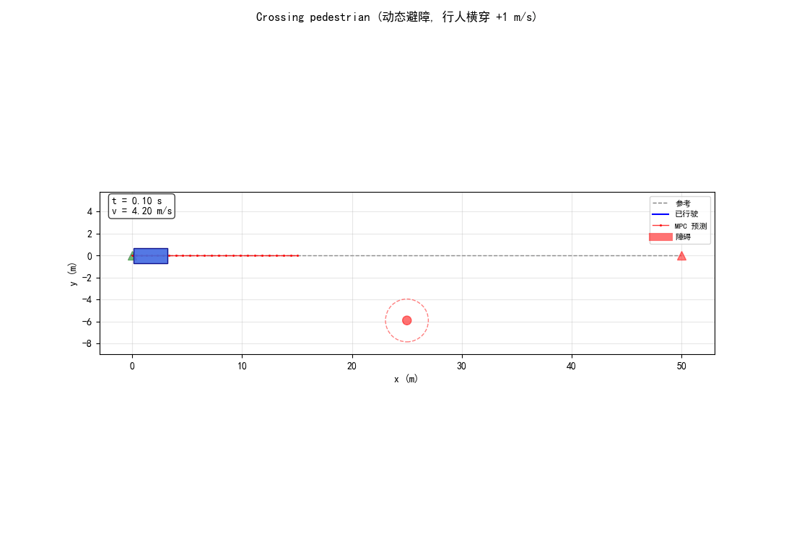
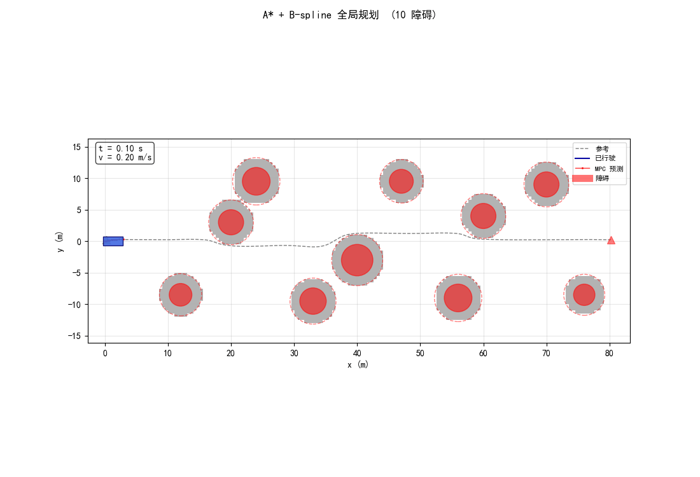

# MPC 轨迹跟踪与决策仿真

一个基于线性化自行车模型 + cvxpy/OSQP 的轨迹跟踪 MPC 项目，逐步扩展为完整的"规划 - 估计 - 控制 - 避障"自动驾驶仿真栈。



> 上图：A\* 全局规划 + B-spline 平滑 + EKF 状态估计 + MPC 闭环跟踪，全 pipeline 联动。

## 项目亮点

- 🚗 **MPC 核心**：cvxpy 参数化 QP + OSQP warm-start，单步 ~5-15 ms；参考窗口按时间取 + `δ_ref = arctan(L·κ)` 前馈，QP 只解扰动
- 📊 **三控制器对比**：MPC / PID(Stanley+PI) / LQR(误差状态+DARE) 在 8 个场景下量化对比跟踪性能
- 🛰️ **EKF 多速率融合**：GPS 5 Hz + 轮速 10 Hz 异步融合，估计误差 < 0.3 m
- 🗺️ **A\* + B-spline 规划**：8 邻域 A\*（膨胀栅格）+ B-spline 平滑 + 等弧长重采样生成参考
- 🚧 **MPC 避障**：半空间硬约束 / 二次惩罚软约束双模式 + 动态障碍不确定性锥（SCP 思想，每步重线性化）

## 项目目的

把"纯 MPC 跟踪 demo"演化为一个能演示完整自动驾驶 pipeline 的 Python 仿真。
具体覆盖：

- **控制层**：MPC、PID（Stanley + PI）、LQR（误差状态）三家对比
- **估计层**：EKF 融合 GPS + 轮速，多速率传感器
- **规划层**：A\* 全局规划 + B-spline 平滑生成参考
- **决策层**：MPC 加避障约束（半空间硬约束 / 二次惩罚软约束两种）
- **障碍**：静态圆障碍 + 动态恒速障碍 + 不确定性锥

## 系统架构

完整的"规划 → 估计 → 控制 → 避障"闭环 pipeline，各层解耦、按场景按需启用：



> 模块依赖与完整调用链见 [STRUCTURE.md](STRUCTURE.md)。

## 快速开始

```bash
# 1. clone
git clone https://github.com/JL7024/MPC.git
cd MPC

# 2. 装依赖（建议先创建虚拟环境）
pip install -r requirements.txt

# 3. 跑一个有代表性的 demo
python main.py --case astar --ekf --no-show
```

输出图保存在当前目录（或用 `--save-dir <dir>` 指定）。完整 CLI 见下方。

## 核心思路 / 算法

> 📈 交互式流程图（浏览器打开）：[MPC 求解流程](docs/mpc_flow.html) · [A\* + MPC 精确联动](docs/astar_mpc_precise.html)

### 车辆模型
后轴中心运动学自行车：
- 状态 `[x, y, phi, v]`
- 控制 `[a, delta]`
- 离散欧拉积分 + 一阶泰勒展开线性化（含仿射项 `c_d`）

### MPC（核心控制器）
- cvxpy 参数化 QP（所有"会变"的量都是 `cp.Parameter`，QP 结构构建一次复用）
- OSQP 求解 + warm start，单步 ~5-15 ms
- 关键 trick：参考窗口按"未来 N 个 dt 时间"取，不按 idx 取（避免 ref 弧长 ds vs MPC 时间步 dt 的错位）
- 反推 `delta_ref = arctan(L·κ)` 作为前馈，让 QP 只解扰动

### 控制器对比
- **PID**：Stanley 横向（`δ = -e_phi - arctan(k·e_lat / v)` + 弯道前馈）+ 速度 PI（含 anti-windup）
- **LQR**：误差状态 `e = [e_lat, e_phi, e_v]`，每步解 DARE 得 K（v 当 frozen parameter，避免 LTV 推导）

### EKF 状态估计
- 标准 EKF：`predict` 用真非线性 `f` 推均值，用 Jacobian `F` 推协方差
- 异步多速率：GPS 5 Hz / σ=0.5 m，轮速 10 Hz / σ=0.1 m/s
- `phi` 残差周期性 wrap 防数值漂移；`P` 每步对称化 `(P + P^T)/2` 防 inv 失败

### A\* + B-spline 规划
- 8 邻域 A\*（直邻 1, 对角 √2），欧氏启发，heapq + counter 防 tie-break
- 障碍栅格化时直接做膨胀（`r_inflate = r_car + margin = 1.55 m`），免去单独膨胀步
- B-spline 平滑（`scipy.interpolate.splprep`）+ 等弧长重采样 + 撞了减半 s 重试
- 输出 waypoints 喂给 `ReferenceTrajectory.generate_from_waypoints` 做最终参考

### MPC 避障
"圆外"集合非凸 → QP 不能直接处理。两条路：

- **硬半空间（hard）** —— B 方案：在 warm-start 预测点 `x̂_k` 处取外法线 `n_k`，加线性约束 `n_k · (x_k - p_obs) >= r_safe`。SCP 思想，每次 solve 重新线性化
- **二次惩罚（soft）** —— A 方案：加 nonneg slack 变量，约束放松为 `n·x + s >= b`，cost 加 `λ·Σs²`。永远 feasible 但不保证不撞，靠 λ 调

动态障碍 = 把 `p_obs` 换成 `obs.predict(k·dt)`，并让 `r_safe(k) = r_safe + α·k·dt`（不确定性锥）。

cvxpy DPP 限制：`Parameter @ Parameter` 不允许，所以 `b_k = r_safe + n·p_obs` 在 numpy 侧预算后单独 Parameter 化。

## 输入与输出

### 输入
**没有外部数据输入**。所有场景都在 [scenarios.py](scenarios.py) 里硬编码：
- 参考轨迹：直线 / 圆 / 双移线 / 加减速直线 / S 形蛇形 / A\* 规划 / 直线+障碍
- 障碍：作为 `(cx, cy, r)` (静态) 或 `(cx, cy, vx, vy, r)` (动态) 元组写在场景里

8 个场景由 `SCENE_REGISTRY` 字典查表，CLI 用 `--case <name>` 选。

### 输出
全部输出到当前工作目录或 `--save-dir` 指定的目录：

- `<scene>.png` —— 6 面板单场景图（XY / 横向误差 / 航向误差 / 速度跟踪 / a / δ）
- `<scene>_ekf_est.png` —— EKF 估计 4 面板（仅 `--ekf` 时）
- `<scene>_planning.png` —— A\* 规划层叠图（仅含 `grid_map` 的场景）
- `<scene>_avoidance.png` —— 避障双面板（仅 `--mpc-avoid` 时）
- `<scene>.gif` —— 动画（仅 `--animate --anim-save out.gif`，需 pillow；mp4 需 ffmpeg）
- 终端打印数值指标（步数 / RMS / max / solve_time）

`baseline_metrics.json` 是 5 个 baseline 场景的精确回归数值，作改动后的 byte-perfect 校验基准。

## 效果展示

| 场景 | 演示 |
|---|---|
| 双移线 (lane change) |  |
| 静态障碍硬约束 |  |
| 动态对向车 |  |
| 行人横穿 |  |
| A\* 全局规划 |  |
| A\* + EKF 全 pipeline |  |

更多控制器对比图、规划/避障对比图见 [`results/`](results/) 目录。

## 如何运行

### 装依赖

```bash
pip install -r requirements.txt
```

实测在 Python 3.14 上跑通。

### 主入口

```bash
# 跑全部场景, 默认 MPC, 不弹窗
python main.py --no-show

# 单场景示例
python main.py --case lane                          # 双移线 + MPC
python main.py --case lane --controller pid         # 同场景换 PID
python main.py --case astar                         # A* 全局规划
python main.py --case lane --ekf                    # 加 EKF 估计反馈
python main.py --case block --mpc-avoid             # 静态避障 (hard)
python main.py --case oncoming --mpc-avoid          # 动态对向车
python main.py --case crossing --mpc-avoid          # 行人横穿
python main.py --case block --mpc-avoid --avoid-mode soft --lambda-soft 1000

# 出动画 (gif)
python main.py --case astar --ekf --animate --anim-save astar_demo.gif
```

### 对比脚本

```bash
python compare.py                       # MPC vs PID vs LQR
python compare.py --case lane

python compare_ekf.py                   # EKF on vs off
python compare_ekf.py --case lane

python compare_avoid_modes.py           # hard vs soft λ 扫描
python compare_avoid_modes.py --case oncoming
```

### CLI 关键参数

| 参数 | 取值 | 默认 | 用途 |
|---|---|---|---|
| `--case` | 8 个场景名 / `all` | `all` | 选场景 |
| `--controller` | `mpc` / `pid` / `lqr` | `mpc` | 选控制器 |
| `--ekf` | flag | off | 启用 EKF 状态估计 |
| `--mpc-avoid` | flag | off | MPC 加避障约束（仅 obstacles 不为空才生效） |
| `--avoid-mode` | `hard` / `soft` | `hard` | 避障约束类型 |
| `--lambda-soft` | float | `1000.0` | soft 模式 slack 惩罚权重 |
| `--animate` | flag | off | 播放动画 |
| `--anim-save` | path | None | 保存动画到 mp4/gif |
| `--save-dir` | path | None | 把图保存到此目录 |
| `--no-show` | flag | off | 不弹窗（只保存） |

### 模块自测

每个模块自带 `__main__` 自测，可单独跑：

```bash
python -m core.vehicle_model       # 线性化对照真非线性
python -m core.reference_trajectory # 三种轨迹生成 + 查询接口
python -m controllers.mpc           # MPC warm-start 求解时间
python -m controllers.pid           # PID Stanley + PI
python -m controllers.lqr           # LQR 完美跟踪 + 偏离测试
python -m estimation.ekf            # EKF predict + GPS update 收敛
python -m estimation.sensors        # 多速率传感器 + 复现性
python -m planning.grid_map         # 栅格 + 圆障碍 + 坐标转换
python -m planning.astar            # A* 性能 + 绕障
python -m planning.smoothing        # B-spline 平滑 + 曲率检查
python -m obstacles.static          # CircleObstacle
python -m obstacles.dynamic         # DynamicObstacle predict/step
```

## 关键依赖

| 库 | 用途 |
|---|---|
| `numpy` | 数值核心 |
| `cvxpy` | MPC 的 QP 建模（参数化、warm start、自动判 DPP） |
| `osqp` | cvxpy 后端求解器（pip 装 cvxpy 时一般会带上） |
| `scipy` | LQR 的 `solve_discrete_are`，B-spline 平滑的 `splprep`/`splev` |
| `matplotlib` | 所有出图 + 动画 |
| `pillow` | 保存 GIF（mp4 需要系统装 ffmpeg） |

## 已知限制

### 算法层

- **`circle + EKF` 收敛慢/卡 max_steps**：`find_nearest` 已加 `N_ROLLBACK=20` 容许 last_idx 微回退（[main.py:108](main.py:108)），把 e_lat_rms 从 5.02m 改善到 4.58m，但闭曲线 + 噪声 + 欧氏距离终止的耦合根因没修。彻底修需重做"按弧长进度终止"
- **B 方案在"障碍正前方 + 直线参考"时局部极小**：法向只有 -x 分量、y 没分量 → MPC 会"停"而非"绕"。`obstacle_blocking_scene` 把障碍稍偏 0.5 m 自然破对称；通用情况依赖上游规划提供方向 hint（`MPCController.avoid_side='left'/'right'`）
- **OSQP `optimal_inaccurate` / `infeasible` 偶发**：动态对向车场景在最危险时刻 (T2C ≈ 0) 出现 1-2 次，靠"沿用上拍 u" fallback 顶过；不稳定但不致命
- **CILQR / SQP 多次重线性化未做**：当前避障是单步线性化（迭代隐式发生在跨 solve 之间），SCP 收敛性有理论局限。学术更精的做法是单步内多次重线性化，但增加 5-10x solve time

### 代码风格层

- 整体使用中文注释（继承自原始 baseline）。如果要给英语圈用，需要翻译关键文档串
- 模块自测的 `if __name__ == "__main__":` 大都用 `sys.path.insert` 处理路径，不优雅但能跑

---

更详细的目录结构与调用链见 [STRUCTURE.md](STRUCTURE.md)。
